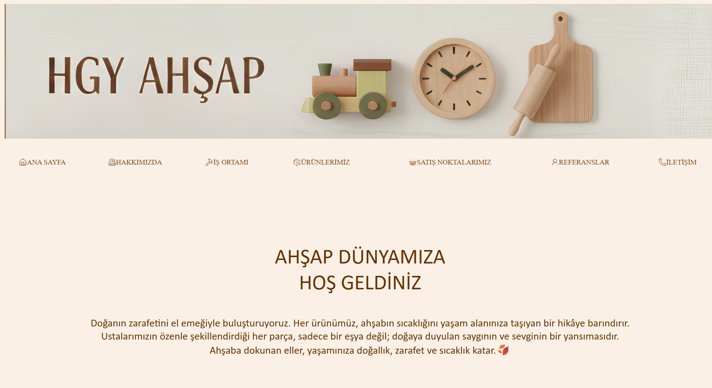

#🌿 HGY Ahşap – Tanıtım Web Sitesi

Bu proje, HGY Ahşap markasına ait ürünlerin tanıtımı için hazırlanmış modern ve sade bir web sitesi tasarımını içermektedir. Web sitesi, ahşap ürünlerin doğallığını ve estetik görünümünü ön plana çıkararak ziyaretçilere görsel açıdan etkileyici bir deneyim sunmayı amaçlar.

📌 Proje Hakkında

HGY Ahşap tanıtım web sitesi; markanın üretmiş olduğu ahşap ürünleri sergilemek ve marka kimliğini dijital ortamda yansıtmak amacıyla geliştirilmiştir.

Bu proje bir e-ticaret sitesi değildir — ürün satışı yerine tamamen bilgilendirme ve görsel sunum odaklıdır.

Sitede yer alan ürün kategorileri:

🧸 Ahşap oyuncaklar
🏡 Ahşap süs eşyaları
🍴 Ahşap mutfak ürünleri
🚀 Kullanılan Teknolojiler

Proje, temel web teknolojileri kullanılarak geliştirilmiştir:

HTML5 → 53 dosya
CSS3 → 1 dosya

Herhangi bir framework veya kütüphane kullanılmadan sade ve anlaşılır bir yapı oluşturulmuştur.

🎨 Tasarım Özellikleri
Minimalist ve temiz arayüz
Doğal ve sıcak renk paleti
Ürün odaklı görsel sunum

🎯 Projenin Amacı
HGY Ahşap markasının dijital tanıtımını yapmak
Ürünleri estetik bir şekilde sergilemek
Temel HTML ve CSS bilgileri ile web arayüzü geliştirmek
